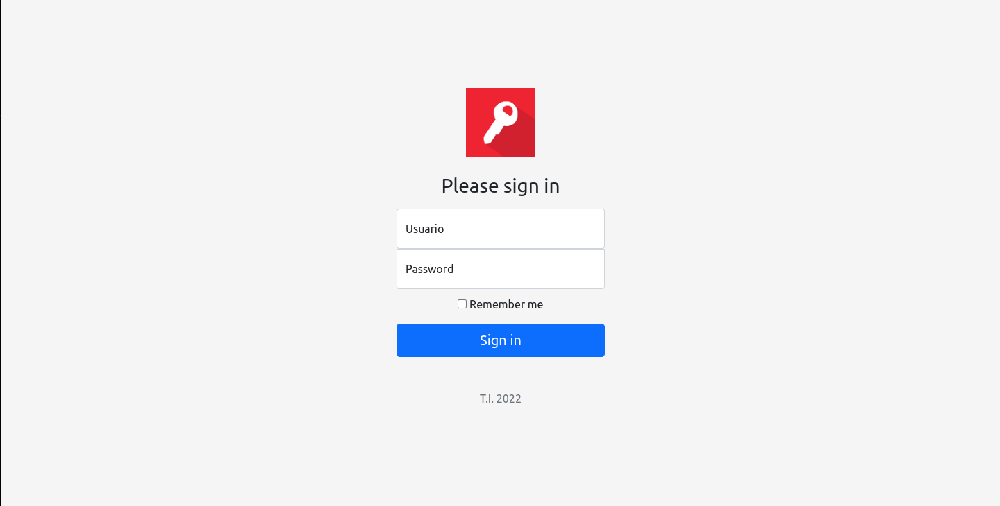
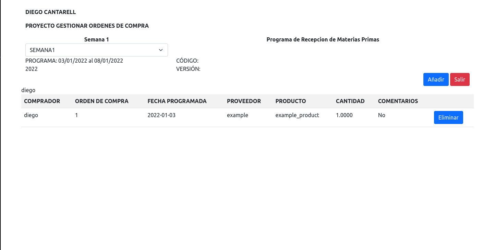
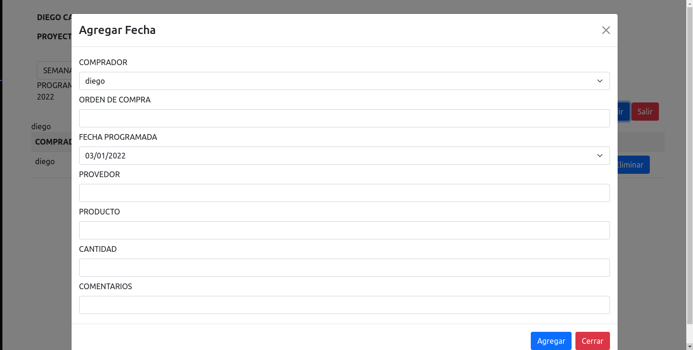

# purchase-order-management
**Website to manage purchase orders**

Purchase Order Management System is a web application designed to streamline the material procurement process. With this system, logged-in users can generate purchase orders with ease. The system allows users to enter essential details such as purchase number, scheduled date, supplier information, product name, quantity, and additional comments. It provides a centralized platform for efficiently managing and tracking purchase orders, enabling effective communication between users and suppliers.

# Login 

# Dashboard

# Add Purchase Order
